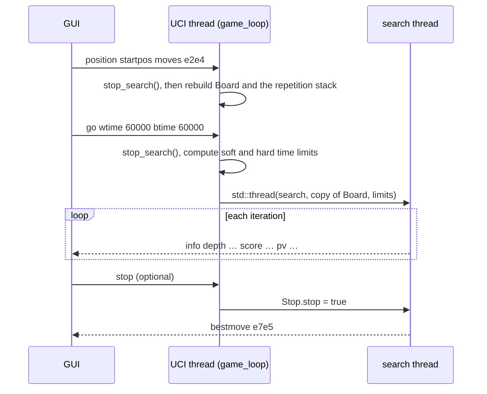

# Architecture

How Buster 7.0 is put together: the modules, the core data structures, and how the UCI thread and
the search thread share work. The algorithms themselves are described in [SEARCH.md](SEARCH.md),
[EVALUATION.md](EVALUATION.md) and [MOVEGEN.md](MOVEGEN.md).

## At a glance

- **Single-threaded search** on one background thread. The main thread runs the UCI command loop.
- **Bitboards plus a mailbox.** Eight piece/colour bitboards, one status word, and a 64-square
  array of piece codes for O(1) "what is on this square".
- **Legal move generation.** Pins and checks are resolved while generating, so every move in a
  list is legal. There is no make-then-test-for-check step.
- **Slider attacks through `PEXT`** lookup tables built once at start-up.
- **16-bit moves** and a **16-byte transposition-table entry** (four per cache line).
- **No heap allocation on the search path.** Move lists and the repetition stack are fixed-size
  arrays, and the search works on one board that it changes and restores in place.

## Source layout

| module | responsibility | main symbols |
|---|---|---|
| `main.cpp` | entry point | `main()` → `run_uci()` |
| `uci.cpp` / `uci.h` | UCI protocol, command loop, move text conversion, owns the search thread | `GUI_Interface`, `game_loop`, `stop_search` |
| `search.cpp` / `search.h` | iterative deepening, alpha-beta, quiescence | `search`, `alpha_beta`, `q_search` |
| `movepicker.cpp` / `movepicker.h` | move-ordering stages and lazy quiet selection | `MovePicker`, `MoveStage` |
| `search_state.cpp` / `search_state.h` | state that lives across nodes: stop flag, parameters, killers, history, continuation history, SEE | `Stop`, `Tune`, `Killers`, `History`, `Continuation`, `Line`, `SEE` |
| `movegen.cpp` / `movegen.h` | legal move generation and check evasion | `generate_moves`, `check_evasion` |
| `position.cpp` / `position.h` | applying and reverting moves, null moves | `make`, `unmake`, `make_new_state`, `make_null`, `unmake_null` |
| `eval.cpp` / `eval.h` | static evaluation | `evaluation` |
| `tt.cpp` / `tt.h` | Zobrist keys, transposition table, repetition stack | `TranspositionTable`, `zobrist` |
| `tables.cpp` / `tables.h` | `PEXT` attack tables; turning target bitboards into move codes | `Initiation` / `Lookup`, `Support` / `Move` |
| `initiation_support.cpp` | builds the masks and lookup contents for `PEXT` | `diag_mask_lookup`, `rank_file_mask_lookup`, `build_passed_pawn_mask` |
| `fen_input.cpp` / `fen_input.h` | FEN parser with validation | `fen_input` |
| `testharness.cpp` / `testharness.h` | perft and built-in self-tests (the `test` command) | `perft`, `TestHarness`, `mirror_board`, `verify_walk` |
| `global_constants.h` | square constants, masks, neighbour tables, evaluation constants, piece indices | `namespace my_const`, `enumPiece` |
| `support_files.h` | the shared data types | `Chess`, `MoveList`, `Position_List`, `tp_table`, `Undo`, `best`, `flat_slider` |
| `piece_table.h` | piece-square tables (material included) | `piece_square_tables` |
| `global_header.h` | standard-library and intrinsic includes | — |

Every module that owns global state follows one pattern: the header declares the type and an
`extern` object, and exactly one `.cpp` defines that object.

## Board representation

### Squares

Squares are numbered **a1 = 0, b1 = 1, … h1 = 7, a2 = 8, … h8 = 63**: little-endian rank-file
order, so bit *n* of a bitboard is square *n*. `global_constants.h` defines a constant for every
square (`a1 = 1`, `b1 = 2`, …, `h8 = 1 << 63`).

### The `Chess` structure

```cpp
struct Chess {
    std::array<uint64_t, 9>  bitboard;           // see the table below
    bool                     pit;                // player in turn: 0 = White, 1 = Black
    std::array<uint16_t, 64> mailbox;            // piece type on each square, 0 = empty
    MoveList                 possible_moves;     // all legal moves: captures first, then quiets
    MoveList                 possible_captures;  // the legal captures on their own
    tp_table                 tpt;                // carries the position's Zobrist key
};
```

| index | name (`enumPiece`) | contents |
|---|---|---|
| 0 | `White` | all white pieces |
| 1 | `Black` | all black pieces |
| 2 | `Pawn` | pawns of both colours |
| 3 | `Knight` | knights of both colours |
| 4 | `Bishop` | bishops of both colours |
| 5 | `Rook` | rooks of both colours |
| 6 | `Queen` | queens of both colours |
| 7 | `King` | kings of both colours |
| 8 | `status` | the status word, below |

A white knight is `bitboard[White] & bitboard[Knight]`. The same indices double as the piece codes
in `mailbox[]` (2 = pawn … 7 = king), so `mailbox[sq]` also indexes `bitboard[]` directly. Using
`pit` and `!pit` as indices selects "side to move" and "opponent".

### The status word (`bitboard[8]`)

Everything about a position that is not piece placement lives in one 64-bit word, so `make` can
save it and `unmake` can restore it with a single copy.

| bits | meaning |
|---|---|
| 0, 7, 56, 63 | castling rights, on the rook's home square: a1 = White O-O-O, h1 = White O-O, a8 = Black O-O-O, h8 = Black O-O. Cleared when that rook leaves or is captured, or when the king leaves e1/e8 |
| 16–23 (rank 3), 40–47 (rank 6) | en-passant target squares, one bit per file |
| 24 | the side to move **is in check** (written by `generate_moves`) |
| 25–31 | the fifty-move (half-move) counter |

The castling and en-passant bits sit on the squares they describe. That lets one mask
(`ep_castling_mask`) pick out exactly the status bits that feed into the Zobrist key.

### Moves (16 bits)

```
 15      10 9        4 3    0
+----------+----------+------+
|   from   |    to    | flag |
+----------+----------+------+
```

| flag | move type |
|---|---|
| 0 | quiet move |
| 1 | pawn double push (creates an en-passant target) |
| 2 | king-side castling |
| 3 | queen-side castling |
| 4 | capture |
| 5 | en-passant capture |
| 8 / 9 / 10 / 11 | promotion to knight / bishop / rook / queen |
| 12 / 13 / 14 / 15 | capture with promotion to knight / bishop / rook / queen |

So bit 2 (value 4) marks a capture and bit 3 (value 8) marks a promotion. The value `0` never occurs
as a real move and means "no move" throughout the program. `from_square_mask` and `to_square_mask`
extract the squares with `_pext_u32`.

### Move lists and the repetition stack

`MoveList` is a fixed array of 256 moves with a count; the most legal moves in any chess position
is 218. `Position_List` is the same idea for 64-bit keys, with room for 512: game history plus the
current search path. Both live on the stack or inside other objects, and neither allocates.

## Global state

| object | type | what it holds | size |
|---|---|---|---|
| `Lookup` | `Initiation` | `PEXT` slider tables (diagonal and rank/file) and passed-pawn masks | 5 248 + 102 400 entries, about 840 KiB |
| `zobrist` | `TranspositionTable` | Zobrist random numbers, the transposition table, the repetition stack | TT 128 MiB by default |
| `Tune` | `Tuning` | search parameters (exposed as UCI options) and the late-move-reduction table | 64 × 64 table |
| `Stop` | `Stop_search` | atomic stop flag, node counter, node limit | — |
| `Killers` | `Killer_table` | two killer moves per ply | 64 plies |
| `History` | `History_table` | quiet-move history, `[side][from][to]` | 16 KiB |
| `Continuation` | `Continuation_table` | history conditioned on the previous move, `[side][prev piece][prev to][piece][to]` | 1 MiB |
| `Line` | `Move_stack` | the move played to reach each ply, as (piece, to-square) | 64 plies |
| `SEE` | `Static_Exchange_Evaluation` | static exchange evaluation | — |
| `Move` | `Support` | turns target bitboards into move codes | — |
| `uci` | `GUI_Interface` | the protocol layer and the search thread | — |

`ucinewgame` clears the transposition table, killers, history and continuation history.

## The transposition table

```cpp
struct tp_table {                // 16 bytes: four entries per 64-byte cache line
    uint64_t zobrist_key_64;     // the FULL key, compared in full on every probe
    int16_t  value;
    int16_t  depth;
    uint16_t move;               // best move found, 0 = none
    char     flag;               // 'e' exact, 'l' lower bound, 'u' upper bound
    uint8_t  generation;         // reserved, unused in 7.0
};
```

- **Size:** a power of two number of entries. The UCI `Hash` option (1–4096 MiB, default 128) is
  rounded **down** to a power of two, and `resize()` frees the old table before allocating the new.
- **Index:** `_pext_u64(key, index_mask)` with `index_mask = (entries − 1) << 20`, i.e. a run of key
  bits starting at bit 20.
- **Verification:** every probe compares the whole 64-bit key, so a false match needs two
  different positions with identical keys. At any table size that is about one probe in 2⁶⁴.
- **Replacement:** one entry per slot. A store is refused only when the *same* position is already
  stored at a *greater* depth; any other store overwrites.
- **Prefetch:** right after a move is made, the child's slot is prefetched, so the memory access
  overlaps with move generation instead of stalling the probe.
- **Keys:** `hash_piece[square][piece][colour]` for pieces, `hash_piece[square][0][0]` for each
  castling and en-passant status bit, `hash_piece[0][0][1]` for Black to move. Keys are updated
  incrementally in `make` and restored from the `Undo` record in `unmake`.

## Threads and lifecycle

### Start-up

1. **Static initialisation:** `Lookup` builds the `PEXT` tables and `Tune` fills the reduction table.
   The tables that everything else depends on are `constexpr`, so there is no dependency on the
   order in which source files are initialised.
2. `run_uci()` generates the Zobrist random numbers from a fixed seed, so keys are identical on
   every run, and enters `game_loop`.

### The two threads



- The UCI thread owns the current game position. `go` hands the search thread **its own copy** of
  the board; the search changes that copy in place and restores it move by move.
- The search thread reads and writes shared global state: the transposition table and repetition
  stack, killers, history, continuation history, `Line`, `Stop` and `Tune`.
- **The rule that keeps this safe:** every command that touches that shared state (`position`,
  `ucinewgame`, `setoption`, `go`, and shutdown) first calls `stop_search()`, which raises the stop
  flag and joins the search thread. A command therefore never changes state under a running search,
  even when a GUI sends one mid-search.
- Before each move is searched, the search checks the stop flag and the node limit, and it reads
  the clock whenever the node count is a multiple of 2 048. An interrupted iteration is discarded,
  and the best move of the last completed iteration is played.
- `bestmove` is written by the search thread itself when it finishes.

### Shutdown

`quit`, or the end of standard input, leaves the command loop through one shared exit that calls
`stop_search()`, so the search thread is always stopped and joined **before** `main` returns and
the global objects it uses are destroyed.

## One node of the search

The board is modified in place. A node saves only what `make` cannot recompute:

```
Undo undo;                         // captured piece, old status word, old Zobrist key
make(board, move, undo);           // pieces, mailbox, status word, key: updated incrementally
zobrist.prefetch(child key);       // start the TT memory access early
generate_moves(board);             // legal moves of the child; sets the in-check bit
repetition stack.push(child key);
    … recurse …
unmake(board, move, undo);         // pieces moved back; status word and key restored from undo
repetition stack.pop();
```

`generate_moves` overwrites the board's move lists, so each node keeps its own list in a local
`MoveList` and restores the board's lists before returning. The null move (`make_null` /
`unmake_null`) only flips the side to move and clears en passant, with the same save-and-restore.

## Build

- `make` compiles with `-O3 -march=native -mbmi2 -Wall -Wextra`, and the tree builds **without
  warnings**. The code needs C++17 and a CPU with BMI2 (see the README).
- `NDEBUG` is not defined, so the few `assert`s (for example on the repetition stack's bounds)
  stay active in the release build.
- `make asan` builds `buster_asan` with AddressSanitizer and UndefinedBehaviorSanitizer.
